# Memory Allocators

> `malloc` is a Swiss Army knife. Sometimes you want a scalpel.

Four custom memory allocators in C++, built from scratch, drawn out picture by picture, and
benchmarked against `malloc` so you can see exactly what you buy — and what you give up.

Every allocator here does the same trick: **grab one big block from the OS up front, then hand out
slices of it yourself.** What separates them is the bookkeeping, and the bookkeeping is the whole
story. Less bookkeeping means faster allocations and tighter rules about how you're allowed to free.

---

## The cheat sheet

| Allocator | Allocate | Free | The rule you must obey | Use it when |
|---|---|---|---|---|
| **Linear** | O(1) | ✗ (all at once) | You can never free one thing | Per-frame scratch memory |
| **Stack** | O(1) | O(1) | Free in LIFO order | Nested scopes, undo-style lifetimes |
| **Pool** | O(1) | O(1) | Every object is the same size | Particles, entities, fixed-size nodes |
| **Free list** | O(N) | O(N) | None | A general-purpose `malloc` replacement |
| `malloc` | O(N) | O(N) | None | When you haven't measured yet |

Read that table top to bottom: **speed is bought with restrictions.** The most useful skill in this
repo is recognizing which restriction your data already satisfies for free.

---

## Table of Contents

- [Build and run](#build-and-run)
- [What's wrong with malloc?](#whats-wrong-with-malloc)
- [What custom allocators have in common](#what-custom-allocators-have-in-common)
- [Linear allocator](#linear-allocator)
- [Stack allocator](#stack-allocator)
- [Pool allocator](#pool-allocator)
- [Free list allocator](#free-list-allocator)
- [Benchmarks](#benchmarks)
- [Choosing one](#choosing-one)
- [Takeaways](#takeaways)
- [Future work](#future-work)

---

## Build and run

```bash
git clone https://github.com/mtrebi/memory-allocators.git
cmake -S memory-allocators -B build
cmake --build build
./build/main
```

`main` runs the benchmark suite in [src/main.cpp](src/main.cpp): every allocator, several block
sizes, sequential and random operation orders. Build with `-D_DEBUG` if you want each allocation and
free traced to stdout with its address, offset and padding — it's the fastest way to *see* the
diagrams below actually happening.

The public interface is deliberately tiny ([includes/Allocator.h](includes/Allocator.h)):

```cpp
Allocator* a = new PoolAllocator(16777216 /* total */, 4096 /* chunk */);
a->Init();                          // one malloc, up front
void* p = a->Allocate(4096, 8);     // size, alignment
a->Free(p);
```

---

## What's wrong with malloc?

Nothing — that's the problem. `malloc` has to be good at *everything*, and being good at everything
costs you:

- **It's general purpose.** One allocator serving 1-byte and 1-GB requests can't specialize for
  either. Every call pays for flexibility you probably aren't using.
- **It sometimes talks to the kernel.** When the heap needs to grow, `malloc` traps into the kernel
  for more memory. That transition is orders of magnitude slower than the arithmetic a custom
  allocator does, and you can't predict when it will hit you.
- **It doesn't know your data.** You do. That knowledge is exactly what the allocators below turn
  into speed.

---

## What custom allocators have in common

- **Few mallocs.** One big chunk at init, then all the work is pointer arithmetic in user space.
- **A side data structure.** A linked list, a stack of markers, a tree — just enough state to
  remember which bytes are free, and no more.
- **Constraints.** Each one narrows what you're allowed to do. That narrowing *is* the optimization.

---

## Linear allocator

📄 [LinearAllocator.h](includes/LinearAllocator.h) · [LinearAllocator.cpp](src/LinearAllocator.cpp)

The simplest allocator that could possibly work: keep an offset into the block and push it forward.
Nothing else exists. Allocations land back to back, so spatial locality is excellent and the only
wasted bytes are alignment padding.

### Data structure

One offset. That's the entire allocator.

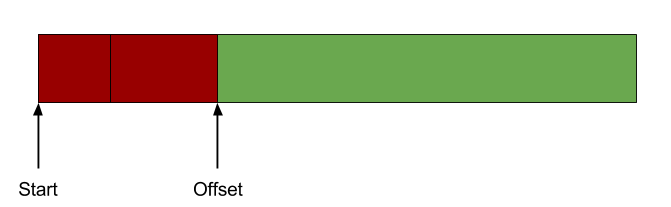

*Complexity: **O(1)***

### Allocate

Align the current address, move the offset forward, return the pointer. Three lines of arithmetic.

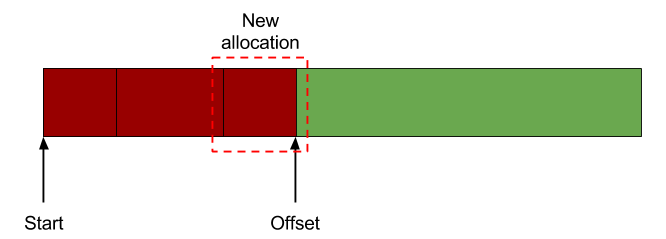

*Complexity: **O(1)***

### Free

You can't — not individually. There's no record of where any allocation started, so the only
operation is `Reset()`, which wipes everything at once.

That sounds crippling until you notice how much real code is shaped exactly like this: a game frame,
a request handler, a parse pass. Allocate freely, throw it all away at the boundary, start over.

---

## Stack allocator

📄 [StackAllocator.h](includes/StackAllocator.h) · [StackAllocator.cpp](src/StackAllocator.cpp)

The linear allocator, plus a rewind button. The offset still only moves forward on allocation — but
now it can also move *back*, as long as you unwind in the reverse of the order you allocated.

### Data structure

An offset, plus a stack of markers recording where each allocation began. The markers live **outside**
the managed block, so the memory you get back carries no per-allocation header — no header padding,
no wasted bytes between your objects.


*Complexity: **O(N)*** in markers, where N is the number of live allocations

### Allocate

Same as linear — align, bump, return — with one extra step: push the pre-allocation offset onto the
marker stack so `Free` knows where to rewind to.

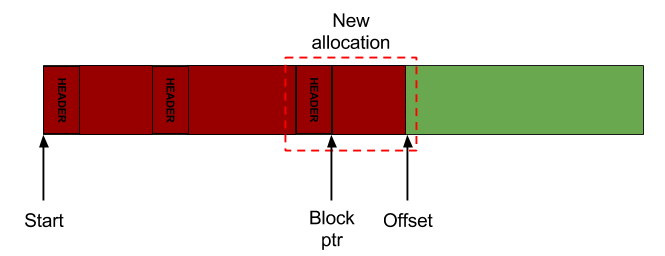

*Complexity: **O(1)***

### Free

Pop the last marker and restore the offset. The allocator never inspects the memory being freed, and
never searches for anything. Freeing out of LIFO order is a bug, and the implementation asserts on it.

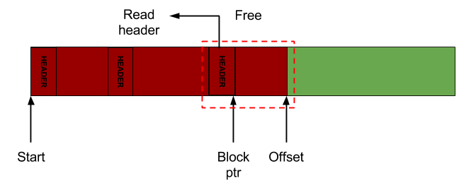

*Complexity: **O(1)***

`Push()` and `Pop(marker)` let you save a checkpoint and roll back a whole batch of allocations in
one shot — a scope guard for memory.

---

## Pool allocator

📄 [PoolAllocator.h](includes/PoolAllocator.h) · [PoolAllocator.cpp](src/PoolAllocator.cpp)

Now for a different idea entirely. Chop the block into equal-sized chunks once, and from then on
"allocate" means "hand over a chunk." Since every chunk is interchangeable, there's nothing to
search for and nothing to fragment.

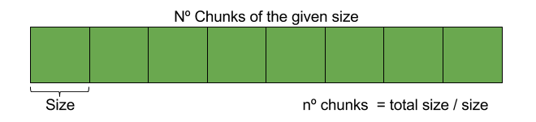

### Data structure

A singly linked list of the free chunks.

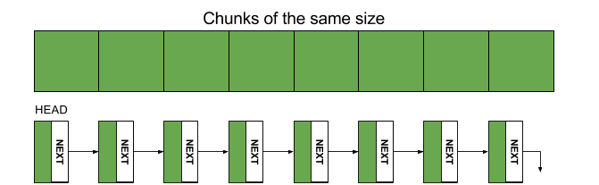

Here's the neat part: **the list nodes live inside the free chunks themselves.** A free chunk isn't
holding anything useful, so it stores the pointer to the next free chunk. The bookkeeping costs zero
extra memory.

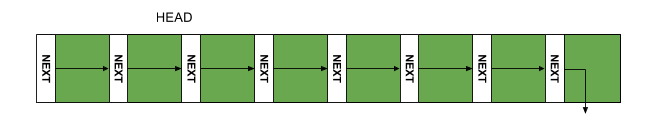

The price of that trick: a chunk must be at least as large as a list node, which is why this
allocator refuses tiny chunk sizes.

*Complexity: **O(1)***

### Allocate

Pop the head of the free list.

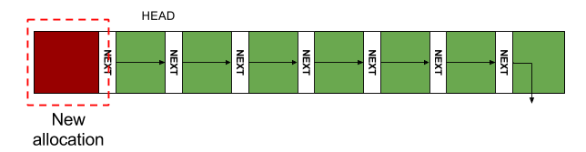

The list makes no attempt to stay sorted — after some churn it weaves through the block in whatever
order things were freed. It doesn't matter. Every chunk is identical, so any chunk will do.

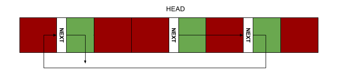

*Complexity: **O(1)***

### Free

Push the chunk back onto the head of the list.

*Complexity: **O(1)***

---

## Free list allocator

📄 [FreeListAllocator.h](includes/FreeListAllocator.h) · [FreeListAllocator.cpp](src/FreeListAllocator.cpp)

The general-purpose one: any size, any order, no rules. That freedom is exactly why it's the slowest
allocator here — with arbitrary sizes and arbitrary lifetimes, holes appear, and finding a hole big
enough means going looking for one.

### Linked list data structure

A linked list of free blocks (address, size), kept **sorted by address**. Allocating searches the
list for a block that fits, splits it, and writes a small header before the returned data recording
its size and padding. Freeing reads that header back, reinserts the block in address order, and
merges it with its neighbours if they're free too — an operation called **coalescence**, and the
reason the list is kept sorted.

> **Note on this implementation:** allocations must be at least as large as a free-list node, with
> similar constraints on alignment — otherwise you'd spend more bytes on metadata than on data. A
> more forgiving implementation is possible but would cost performance; if you're hitting those
> limits, a different allocator is the better answer.

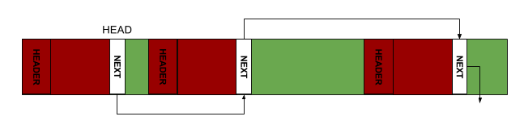

*Complexity: **O(N·HF + M·HA) → O(M)*** — N free blocks with header size HF, M allocated blocks with
header size HA

### Linked list allocate

Walk the list until a block fits. Two policies are available
([`PlacementPolicy`](includes/FreeListAllocator.h)):

- **`FIND_FIRST`** — take the first block that fits. Stops early, faster.
- **`FIND_BEST`** — scan everything, take the *smallest* block that fits. Always O(N), but leaves
  less fragmentation behind.

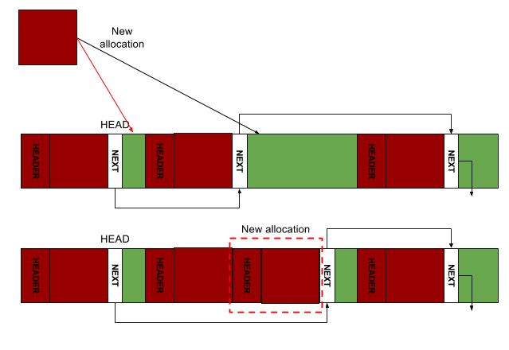

*Complexity: **O(N)*** where N is the number of free blocks

### Linked list free

Read the header for the block's size, walk the list to the right insertion point (it's sorted by
address), insert, then coalesce with the previous and next blocks if they're adjacent in memory.
The coalescing itself is O(1) precisely *because* the list is sorted — only two neighbours can ever
be merge candidates.

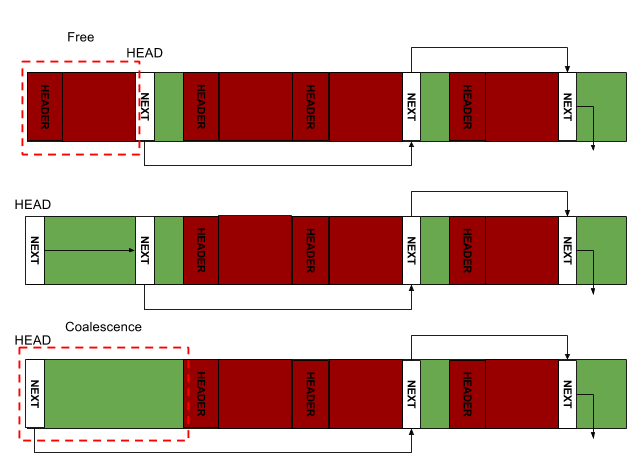

*Complexity: **O(N)*** where N is the number of free blocks

### Red-black tree variant

*(Described here, not implemented — see [Future work](#future-work).)*

Replace the linear scan with a red-black tree of free blocks keyed by size and both operations drop
from O(N) to **O(log N)**, while the tree nodes still live inside the free blocks so space stays
cheap. It also makes **best-fit** affordable, cutting fragmentation without the linear cost. A
separate sorted doubly linked list is still needed to keep coalescence O(1).

This is the design most real production allocators converge on: near-general-purpose flexibility,
logarithmic cost.

---

## Benchmarks

Time is measured from `Init()` (the one big `malloc` plus any data-structure setup) through the last
operation, across block sizes from 32 B to 4 KB in both sequential and random order.

### Time complexity

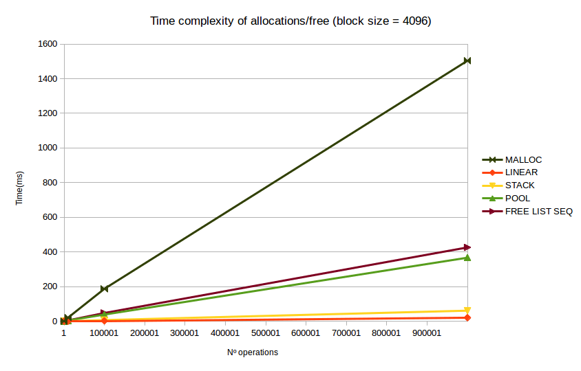

- **`malloc` is comfortably the worst**, and for a good reason — it's paying for generality. **O(n)**
- **Free list is roughly 3× faster than `malloc`** while offering the same freedom. If you need a
  general-purpose allocator, this is the trade you want. **O(n)**

The remaining three are faster still, but only because they've stopped being general purpose:

- **Pool** looks merely *slightly* better than the free list — which should be suspicious, since its
  operations are O(1). The culprit is `Init()`: carving the block into chunks and threading them onto
  the free list is O(n), and that one-time cost is drowning out the constant-time operations.
- **Stack** and **Linear** are O(1) but likewise not perfectly flat on the chart, for the same
  reason — the initial `malloc` of the big block is in the measurement.

**The lesson: initialize your allocators up front, outside the hot path.** Here's the same benchmark
with `Init()` excluded:

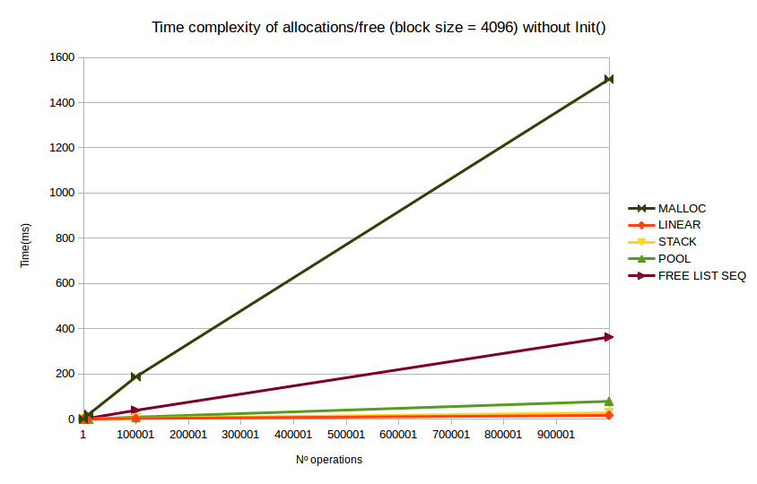

Now the truth shows: Linear, Stack and Pool are flat lines, `malloc` and free list are clearly
linear. A red-black-tree free list would sit between the pool and the linked-list free list, at
**O(log n)**.

*Note: within a single allocation, cost still scales roughly linearly with the requested size.*

### Space complexity

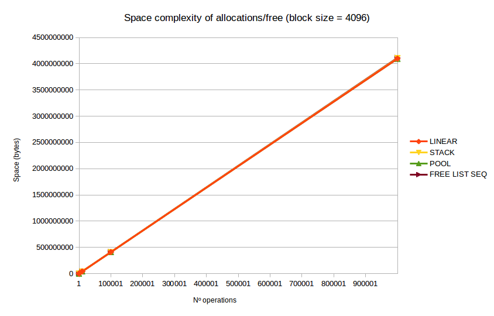

All five are **O(N)** — the constants differ (headers, node sizes, padding), but the lines converge
in shape. It's a tidy demonstration of why big-O drops constants: as N grows, they stop mattering.

---

## Choosing one

Work down this list and stop at the first one your data allows — most restrictive first, because
most restrictive is fastest:

1. **Linear** — your data has no structure, but it has a *deadline*. Everything allocated in a phase
   dies at the end of that phase. Game frames are the canonical case: allocate all frame, reset at
   the top of the next one.
2. **Stack** — same idea, but lifetimes nest. Last allocated, first freed.
3. **Pool** — everything is the same size. Fast, zero fragmentation, no thinking required.
4. **Buddy** *(not implemented)* — sizes cluster around powers of two (1, 2, 4, 8, 16…). Excellent
   speed with very little waste when your data really is shaped that way.
5. **Free list** — no structure, no pattern, no promises. Still meaningfully better than `malloc`.

**When in doubt, pick the more general one.** You can always tighten later once you understand your
data; discovering mid-project that your lifetimes aren't LIFO after all is a much worse day.

---

## Takeaways

- **Avoid dynamic memory where you can.** The cheapest allocation is the one you don't make.
- **If you do need it and you care about speed, don't settle for `malloc`.** The gap is large and
  the implementations here are a few hundred lines each.
- **Understand your data first.** The whole performance story in this repo is the gap between the
  specific allocators (Linear, Stack, Pool) and the general ones (free list, `malloc`) — and you
  only get to cross that gap by knowing something about your data that `malloc` can't.
- **Start general, specialize later.** Restrictions you can't actually satisfy turn into bugs.

---

## Future work

- Assume 8-byte alignment everywhere so headers can be dropped entirely
- Free list backed by a red-black tree: O(N) → O(log N)
- A buddy allocator
- A slab allocator
- Benchmark internal fragmentation
- Benchmark spatial locality (cache misses)

---


